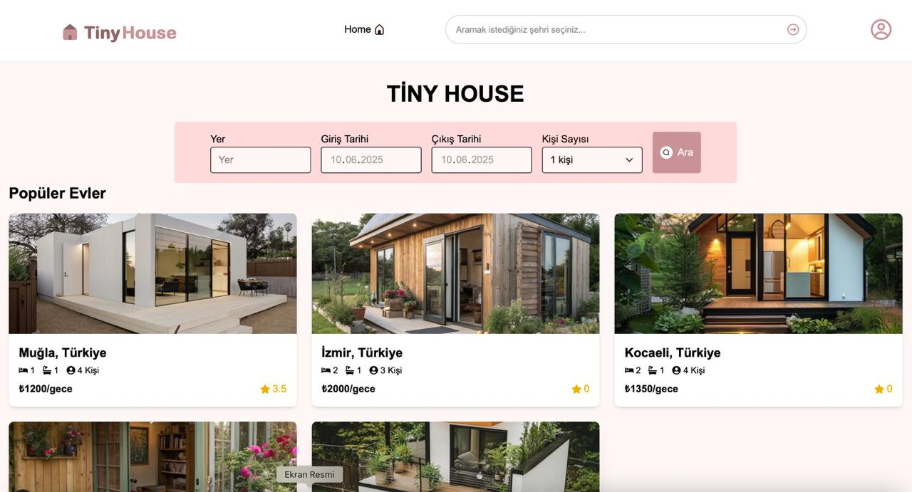
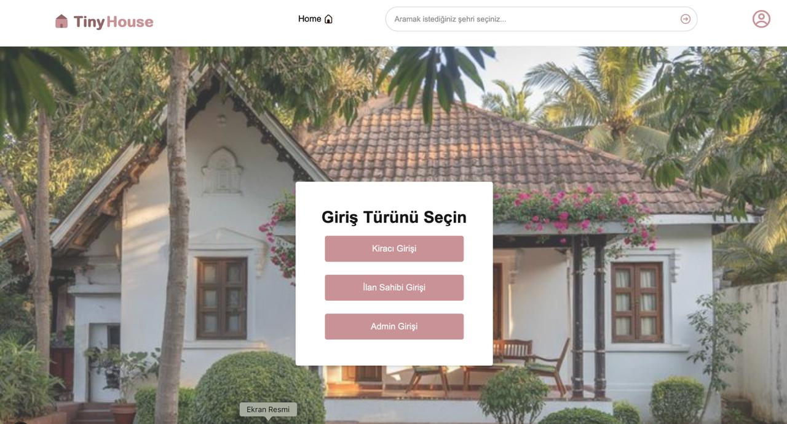
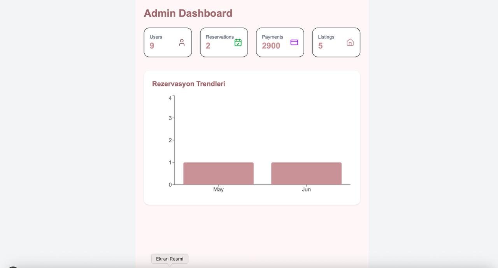

# 🏡 TinyHouse

TinyHouse, kullanıcıların küçük evleri (tiny house) arayabileceği, ilan verebileceği ve rezervasyon yapabileceği modern bir web uygulamasıdır.  
Kapsamlı arama, ilan detayları, rezervasyon, yorum ve puanlama gibi pek çok özellik sunar.

---

## 🚀 Özellikler

- Kullanıcı kaydı ve oturum açma
- Tiny house ilanı ekleme ve düzenleme (ev sahipleri için)
- Şehir, kapasite ve tarih aralığına göre filtreleme & arama
- İlan detay sayfası (fiyat, açıklama, özellikler, fotoğraflar, takvim ile rezervasyon)
- Yorum ekleme ve puanlama
- Rezervasyon oluşturma ve uygunluk takvimi
- Modern ve kullanıcı dostu arayüz

---

## 🛠️ Kullanılan Teknolojiler

- **Frontend:** Next.js, React, Tailwind CSS, shadcn/ui, React Icons
- **Backend:** ASP.NET Core Web API
- **Veritabanı:** MSSQL Server
- **ORM:** ADO.NET
- **Versiyon Kontrol:** Git, GitHub

---

## 💻 Kurulum ve Çalıştırma

### 1. Kaynak Kodunu Klonla

bash
git clone https://github.com/Sude2012/tinyhouse.git
cd tinyhouse
2. Veritabanı Kurulumu
MSSQL Server kurulu olmalı.
TinyHouseProject isimli bir veritabanı oluştur.
Gerekli tablo ve prosedürleri, projenin sql veya docs klasöründe verilen SQL scriptleri ile oluştur.
Bağlantı bilgisini appsettings.json veya Program.cs dosyasında düzenle.

3. Backend (API) Başlat
bash
Kopyala
cd Api
dotnet restore
dotnet build
dotnet run
4. Frontend (Next.js) Başlat
bash
Kopyala
cd frontend
npm install
npm run dev
Uygulama varsayılan olarak http://localhost:3000 adresinde çalışacaktır.

🗄️ Veritabanı Yapısı
Users: Kullanıcı bilgileri
Houses: Tiny house ilanları
Reservations: Rezervasyon kayıtları
Reviews: Kullanıcı yorum ve puanlamaları
Houses_LOG: İlan değişiklik geçmişi
Detaylı tablo yapısı ve örnek SQL scriptleri için sql veya docs klasörünü inceleyiniz.

✨ Kullanım
Kayıt Ol & Giriş Yap: Kullanıcı oluşturup giriş yapabilirsiniz.
Ev Ara & Filtrele: Şehir, kapasite ve tarihe göre filtreleyebilirsiniz.
İlan Detayı: Fiyat, açıklama, fotoğraflar ve uygunluk takvimini görebilirsiniz.
Rezervasyon: Takvim üzerinden giriş-çıkış tarihini seçip rezervasyon oluşturabilirsiniz.
Yorum & Puan: İlanlara yorum ve puan bırakabilirsiniz.
Ev Sahibi Özellikleri: İlan ekleyip düzenleyebilirsiniz.

📸 Ekran Görüntüleri
Ana Sayfa:

Giriş Yap Sayfası:

Admin Sayfası:

🤝 Katkıda Bulunanlar
Sude2012
beyzaincehasan